# Power Zone Diagrams for "Safe to Go: Operations Manual"

Three comprehensive visual representations designed for maximum clarity, precision, and visual appeal.

---

## Zone 1: Operational Authority Framework

**Location:** Page 4 (Power Zone Framework Overview section)  
**Purpose:** Illustrate intersection of High Security Clearance, Mission-Critical Personnel, and Emergency Protocol Active  
**Style System:** Purple theme for authority/intersection

```mermaid
graph TD
    subgraph "Zone 1: Operational Authority"
        direction TB
        A[🛡️ High Security Clearance<br/>Level 4 or Above] --> Z
        B[👥 Mission-Critical Personnel<br/>Authorized Roles Only] --> Z
        C[🚨 Emergency Protocol Active<br/>Confirmed Situation] --> Z
        
        Z[<b>POWER ZONE 1</b><br/>Full Operational Authority<br/><font size='2'>Simultaneous intersection of all three criteria</font>]
        
        A_Desc[Required for classified systems<br/>and sensitive operations] -.-> A
        B_Desc[Designated response teams<br/>and leadership personnel] -.-> B
        C_Desc[Automated alert or manual<br/>confirmation required] -.-> C
    end
    
    style Z fill:#7e57c2,stroke:#5e35b1,stroke-width:4px,color:#ffffff
    style A fill:#4a90e2,stroke:#1565c0,color:#ffffff
    style B fill:#50c878,stroke:#2e7d32,color:#ffffff
    style C fill:#ffd700,stroke:#f57c00,color:#000000
    style A_Desc fill:#f5f5f5,stroke:#e0e0e0
    style B_Desc fill:#f5f5f5,stroke:#e0e0e0
    style C_Desc fill:#f5f5f5,stroke:#e0e0e0
```



**Alternative:** If you have a PNG/SVG of the Venn diagram (as shown in the image), use that instead. Place it in the portfolio directory as `power_zone_1_venn.png` or `power_zone_1_venn.svg`.

---

## Zone 2: Operational Response Flowchart

**Location:** Page 5 (System Architecture section)  
**Purpose:** Show operational workflow through threat assessment, system status checks, and team readiness verification  
**Style System:** Blue/green progression for operational flow

```mermaid
flowchart TD
    Start([Operational Sequence Initiated<br/><font size='2'>Environmental Scan Complete</font>]) --> D1{<b>Threat Assessment</b><br/>Threat Level > 7.0?}
    
    D1 -- "✅ Yes" --> A1[🛡️ Activate Defensive Measures<br/><font size='2'>Perimeter security enabled</font>]
    D1 -- "❌ No" --> E1[📊 Routine Monitoring<br/><font size='2'>Standard protocols active</font>]
    
    A1 --> D2{<b>System Status Check</b><br/>Integrity > 90%?}
    
    D2 -- "✅ Yes" --> A2[🚀 Initiate Protocol Alpha<br/><font size='2'>Advanced systems engaged</font>]
    D2 -- "❌ No" --> E2[⚡ Contingency Plan 3<br/><font size='2'>Backup systems activated</font>]
    
    A2 --> D3{<b>Team Readiness Verification</b><br/>Status = GREEN?}
    
    D3 -- "✅ Yes" --> A3[🎯 Execute Primary Mission<br/><font size='2'>All systems operational</font>]
    D3 -- "❌ No" --> E3[⏸️ Standby Mode<br/><font size='2'>Awaiting clearance</font>]
    
    A3 --> End([✅ <b>MISSION ACTIVE</b><br/>Power Zone 2 Engaged<br/><font size='2'>Maximum operational capacity</font>])
    
    style Start fill:#e3f2fd,stroke:#1565c0
    style End fill:#e8f5e9,stroke:#2e7d32,stroke-width:3px
    style E1 fill:#fce4ec,stroke:#c2185b
    style E2 fill:#fff3e0,stroke:#ef6c00
    style E3 fill:#fff3e0,stroke:#ef6c00
    style D1 fill:#bbdefb,stroke:#1976d2
    style D2 fill:#bbdefb,stroke:#1976d2
    style D3 fill:#bbdefb,stroke:#1976d2
```



---

## Zone 3: Crisis Decision Matrix

**Location:** Page 13 (Data Collection & Pattern Recognition section)  
**Purpose:** Decision tree for incident severity classification with clear escalation paths  
**Style System:** Color-coded severity levels (green→yellow→red→black)

```mermaid
flowchart TD
    Start([📢 Incident Detection<br/><font size='2'>Automated alert triggered</font>]) --> D1{<b>Severity Classification</b><br/>Select incident level}
    
    subgraph "Level 1: Low Severity"
        D1 -- "🟢 Low" --> A1[📝 Log Incident & Assess<br/><font size='2'>Documentation only</font>] --> E1([🔄 Resume Normal Operations])
    end
    
    subgraph "Level 2: Medium Severity"
        D1 -- "🟡 Medium" --> A2[👥 Assign Response Team] --> D2{Immediate Availability?}
        D2 -- "✅ Available" --> E2([📍 Team Deployed])
        D2 -- "❌ Unavailable" --> E3([⏰ Escalate to Next Shift])
    end
    
    subgraph "Level 3: High Severity"
        D1 -- "🔴 High" --> A3[🚨 Activate Crisis Management] --> D3{Executive Approval Received?}
        D3 -- "✅ Approved" --> E4([⚡ Initiate Protocol Beta])
        D3 -- "❌ Pending" --> E5([📞 Notify Emergency Authorities])
    end
    
    subgraph "Level 4: Critical Severity"
        D1 -- "⚫ Critical" --> A4[🔒 Full System Lockdown] --> D4{Threat Confirmation?}
        D4 -- "✅ Confirmed" --> E6([💥 Execute Emergency Override])
        D4 -- "❌ False Alarm" --> E7([🔄 System Reboot Sequence])
    end
    
    style Start fill:#f3e5f5,stroke:#7b1fa2
    style A1 fill:#e8f5e8,stroke:#388e3c
    style A2 fill:#fff3e0,stroke:#f57c00
    style A3 fill:#ffebee,stroke:#d32f2f
    style A4 fill:#212121,stroke:#000000,color:#ffffff
    style E1 fill:#c8e6c9,stroke:#2e7d32
    style E2 fill:#ffe082,stroke:#f57c00
    style E3 fill:#ffe082,stroke:#f57c00
    style E4 fill:#ffcdd2,stroke:#d32f2f
    style E5 fill:#ffcdd2,stroke:#d32f2f
    style E6 fill:#212121,stroke:#000000,color:#ffffff
    style E7 fill:#e0e0e0,stroke:#757575
    style D1 fill:#e1f5fe,stroke:#0288d1,stroke-width:2px
```



---

## Implementation Instructions

### For Direct Use:

1. **Copy each code block** into [Mermaid Live Editor](https://mermaid.live/)
2. **Adjust colors or text** as needed
3. **Export as PNG** (300 DPI recommended for print)
4. **Save files:**
   - `power_zone_1_operational_authority.png` (or use your existing Venn PNG/SVG)
   - `power_zone_2_operational_response.png`
   - `power_zone_3_crisis_decision.png`

### Visual Consistency:

- **Zone 1:** Purple theme for authority/intersection
- **Zone 2:** Blue/green progression for operational flow
- **Zone 3:** Color-coded severity levels (green→yellow→red→black)

### Manual Integration:

- These diagrams directly replace placeholders in your manual
- Each includes descriptive text for accessibility
- Decision points are clearly marked for operator guidance

### Key Design Features:

- ✅ **Color-coded** severity and status levels
- ✅ **Clear decision paths** with yes/no branches
- ✅ **Descriptive labels** for each step
- ✅ **Consistent visual language** across all zones
- ✅ **Mobile-responsive** design (if used digitally)
- ✅ **Accessibility-friendly** color contrast

---

## Integration into PDF

After exporting diagrams from Mermaid Live Editor:

1. **Save all diagram files** in `/Users/timothywheels/Projects/portfolio/`:
   - `power_zone_1_venn.png` (your existing Venn diagram image)
   - `power_zone_2_operational_response.png` (export from Mermaid)
   - `power_zone_3_crisis_decision.png` (export from Mermaid)

2. **Run the updated PDF generator** which will automatically insert images:
   ```bash
   cd /Users/timothywheels/Projects/portfolio
   python3 generate_safe_to_go_manual_with_images.py
   ```

   The generator will:
   - Insert Zone 1 image (PNG/SVG) if found
   - Insert Zone 2 flowchart if `power_zone_2_operational_response.png` exists
   - Insert Zone 3 flowchart if `power_zone_3_crisis_decision.png` exists
   - Show placeholder boxes if images are missing

---

## Alternative Export Methods

### Option 1: Mermaid Live Editor (Recommended)
- Go to https://mermaid.live/
- Paste diagram code
- Click "PNG" to export at 300 DPI
- Save to portfolio directory

### Option 2: Mermaid CLI (Command Line)
```bash
npm install -g @mermaid-js/mermaid-cli
mmdc -i zone_2.mmd -o power_zone_2_operational_response.png -w 2400 -H 1800 -b transparent
```

### Option 3: Use Existing Venn Diagram
If you already have `power_zone_1_venn.png` or `.svg` from your design tool, place it in the portfolio directory and the PDF generator will automatically use it.

---

## Notes

- All diagrams are ready for immediate integration
- Color schemes match CYW OS branding where applicable
- Diagrams provide intuitive, at-a-glance guidance through all power zone protocols
- Text is readable at both screen and print resolutions

---

# Multi-Layered Orchestration Model for Content & Application Production

**Purpose:** Visual representation of the complete system architecture from input gathering to final output deployment  
**Style System:** Color-coded layers representing different stages of the production pipeline

```mermaid
flowchart TD
    M[<b>🔄 META-LAYER: ORCHESTRATION</b><br/>VLAN 99: Notion AI - Virgil OS Guardian Mode<br/>• Workspace operations • VOS enforcement<br/>• Database management • Audit logging]
    
    L1A[<b>🔍 LAYER 1: SCOUTS (INPUT)</b><br/>VLAN 10: Perplexity - Research, citations, fact-checking<br/>VLAN 60: Grok - Real-time web, X/Twitter, social signals<br/>External: Reddit • Pinterest • Snapchat<br/><i>Role: Signal detection, pattern recognition, terrain mapping</i>]
    
    L2A[<b>📖 LAYER 2: STORYWEAVERS (NARRATIVE)</b><br/>VLAN 20: Claude - Primary narrative engine<br/>  • Story development • Human systems logic<br/>  • Emotional grounding • High-fidelity writing<br/>VLAN 21: Claude - Narrative expansion<br/>  • Deep concept development • Rhetorical sophistication<br/>  • Metaphor construction<br/><i>Role: Transform signals into coherent narrative</i>]
    
    L3A[<b>💡 LAYER 3: STRATEGISTS (CLARITY)</b><br/>VLAN 40: Gemini - Clarity audit, flow optimization<br/>• Redundancy removal • Readability enhancement<br/>• Logic strengthening • No tone shifting<br/><i>Role: Refine narrative for maximum clarity and impact</i>]
    
    L4A[<b>🏗️ LAYER 4: ARCHITECTS (STRUCTURE)</b><br/>VLAN 30: DeepSeek - Structural critique, pressure-testing<br/>• Logic integrity • Architectural analysis<br/>• Compression & optimization • No unexplained deletions<br/><i>Role: Verify structural coherence and logical integrity</i>]
    
    L5A[<b>🔨 LAYER 5: BUILDERS (CREATION/EXPERIMENTATION)</b><br/><b>Code & Automation:</b> VLAN 70: Cursor • VLAN 77: CLI/Terminal<br/>  VLAN 80: VSCode • Replit<br/><b>Experience & Apps:</b> VLAN 75: Unity • Lovable<br/><i>Role: Transform concepts into functional tools and experiences</i>]
    
    L6A[<b>🔗 LAYER 6: INTEGRATORS (SYNTHESIS)</b><br/>VLAN 50: ChatGPT - Final integration, branding, polish<br/>  • Synthesis across models • Voice matching<br/>  • CYW signature application • Final packaging<br/>n8n - Workflow automation, cross-platform routing<br/><i>Role: Unify all inputs into cohesive, branded output</i>]
    
    L7A[<b>🎤 LAYER 7: VOICES/EXPRESSION (OUTPUT)</b><br/><b>Voice Production:</b> ElevenLabs - Text-to-speech, branded narration<br/><b>Visual Production:</b> Manus - Video editing, visual storytelling<br/><b>Social Distribution:</b> LinkedIn • X/Twitter • Instagram • TikTok • Substack<br/><i>Role: Transform integrated content into deployed output</i>]
    
    M --> L1A
    L1A --> L2A
    L2A --> L3A
    L3A --> L4A
    L4A --> L5A
    L5A --> L6A
    L6A --> L7A
    
    style M fill:#7e57c2,stroke:#5e35b1,stroke-width:3px,color:#ffffff
    style L1A fill:#e3f2fd,stroke:#1565c0,stroke-width:2px
    style L2A fill:#f3e5f5,stroke:#7b1fa2,stroke-width:2px
    style L3A fill:#fff3e0,stroke:#ef6c00,stroke-width:2px
    style L4A fill:#e8f5e9,stroke:#2e7d32,stroke-width:2px
    style L5A fill:#e0f2f1,stroke:#00695c,stroke-width:2px
    style L6A fill:#fce4ec,stroke:#c2185b,stroke-width:2px
    style L7A fill:#fff9c4,stroke:#f57f17,stroke-width:2px
```

## Architecture Overview

This diagram outlines a multi-layered orchestration model for content and application production, structured as follows:

### Layer Flow
1. **META-LAYER**: Centralized control via Notion AI (Virgil OS Guardian Mode)
2. **LAYER 1 (SCOUTS)**: Input aggregation from research platforms and social signals
3. **LAYER 2 (STORYWEAVERS)**: Narrative development using Claude
4. **LAYER 3 (STRATEGISTS)**: Clarity optimization via Gemini
5. **LAYER 4 (ARCHITECTS)**: Structural integrity through DeepSeek
6. **LAYER 5 (BUILDERS)**: Code and experience creation
7. **LAYER 6 (INTEGRATORS)**: Synthesis and branding with ChatGPT and n8n
8. **LAYER 7 (VOICES/EXPRESSION)**: Final output production and distribution

### Design Features
- ✅ **Color-coded layers** for visual distinction
- ✅ **VLAN assignments** clearly marked
- ✅ **Role descriptions** for each layer
- ✅ **Sequential flow** from orchestration to output
- ✅ **External platform integration** indicated

---

## Export Instructions

To export this diagram:

1. **Copy the Mermaid code** above
2. **Paste into** [Mermaid Live Editor](https://mermaid.live/)
3. **Export as PNG** (300 DPI recommended) or SVG
4. **Save as:** `multi_layer_orchestration_architecture.png`
